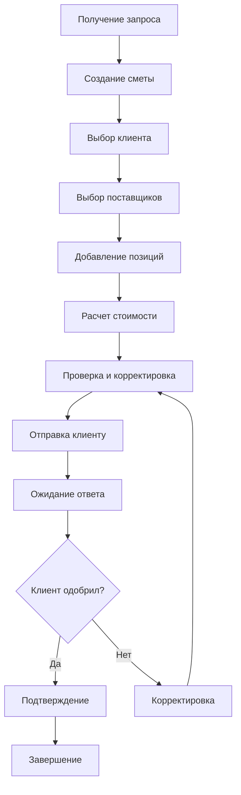
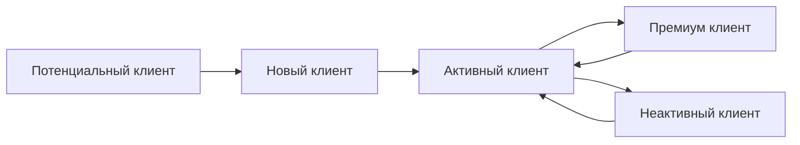
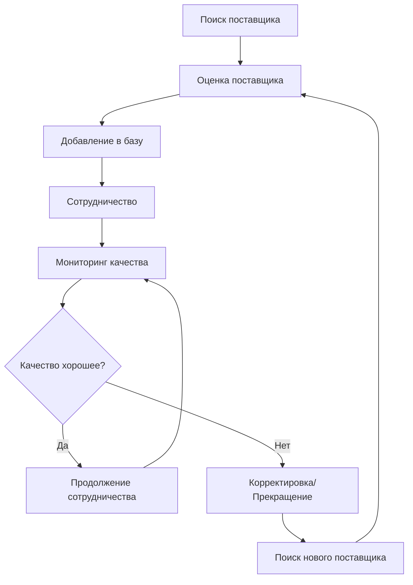

# Бизнес-процессы

## 🎯 Обзор бизнес-процессов

MAGELLANIA Travel System автоматизирует ключевые бизнес-процессы туристического агентства, обеспечивая эффективное управление сметами, клиентами и поставщиками.

## 📋 Основные бизнес-процессы

### 1. Процесс создания сметы

#### Этапы процесса



#### Детальное описание этапов

**1. Получение запроса**

- Источник: телефон, email, личная встреча
- Фиксация требований клиента
- Определение сроков и бюджета

**2. Создание сметы**

- Создание новой записи в системе
- Присвоение уникального номера
- Установка статуса "draft"

**3. Выбор клиента**

- Поиск существующего клиента
- Создание нового клиента при необходимости
- Определение сегмента клиента

**4. Выбор поставщиков**

- Анализ доступных поставщиков
- Проверка рейтингов и отзывов
- Выбор оптимальных вариантов

**5. Добавление позиций**

- Выбор услуг из тарифной сетки
- Настройка количества и параметров
- Добавление кастомных позиций

**6. Расчет стоимости**

- Автоматический расчет по позициям
- Применение скидок и надбавок
- Формирование итоговой суммы

**7. Проверка и корректировка**

- Проверка корректности расчетов
- Согласование с клиентом
- Внесение изменений при необходимости

**8. Отправка клиенту**

- Генерация PDF документа
- Отправка по email
- Установка статуса "sent"

**9. Ожидание ответа**

- Мониторинг статуса
- Напоминания при необходимости
- Обновление информации

**10. Подтверждение/Корректировка**

- При одобрении: статус "approved"
- При отклонении: возврат к корректировке
- Фиксация финальной версии

### 2. Процесс управления клиентами

#### Жизненный цикл клиента



#### Сегментация клиентов

**Новый клиент (new)**

- Первый заказ
- Требует особого внимания
- Потенциал для развития

**Обычный клиент (regular)**

- Регулярные заказы
- Стабильный доход
- Стандартное обслуживание

**Премиум клиент (premium)**

- Высокий доход
- Сложные запросы
- Персональное обслуживание

#### Процесс работы с клиентами

**1. Привлечение**

- Маркетинговые активности
- Рекомендации существующих клиентов
- Партнерские программы

**2. Онбординг**

- Первичная консультация
- Создание профиля в системе
- Определение потребностей

**3. Обслуживание**

- Регулярные заказы
- Консультации и поддержка
- Развитие отношений

**4. Удержание**

- Программы лояльности
- Персональные предложения
- Качественное обслуживание

### 3. Процесс работы с поставщиками

#### Управление поставщиками



#### Критерии оценки поставщиков

**Качество услуг (40%)**

- Соответствие описанию
- Время выполнения
- Качество результата

**Надежность (30%)**

- Соблюдение сроков
- Стабильность работы
- Готовность к сотрудничеству

**Цена (20%)**

- Конкурентность цен
- Прозрачность тарификации
- Гибкость в ценообразовании

**Коммуникация (10%)**

- Скорость ответов
- Качество взаимодействия
- Готовность к диалогу

## 🔄 Автоматизированные процессы

### 1. Автоматический расчет смет

```javascript
// Логика расчета сметы
function calculateEstimate(estimateId) {
  const items = getEstimateItems(estimateId)
  const subtotal = items.reduce((sum, item) => sum + item.total_price, 0)
  const discount = calculateDiscount(subtotal, clientSegment)
  const tax = calculateTax(subtotal - discount)
  const total = subtotal - discount + tax

  return {
    subtotal,
    discount,
    tax,
    total,
  }
}
```

### 2. Система уведомлений

**Типы уведомлений:**

- Создание новой сметы
- Изменение статуса сметы
- Напоминания о сроках
- Новые сообщения от клиентов

**Каналы доставки:**

- Email уведомления
- Push уведомления (планируется)
- SMS (планируется)

### 3. Аналитика и отчетность

**Автоматические отчеты:**

- Еженедельные отчеты по сметам
- Месячная статистика клиентов
- Анализ эффективности поставщиков
- Финансовые отчеты

## 📊 Метрики и KPI

### Ключевые показатели

**Эффективность смет:**

- Время создания сметы
- Процент одобренных смет
- Средняя стоимость сметы
- Конверсия смет в заказы

**Клиентские метрики:**

- Количество активных клиентов
- Средний чек клиента
- Частота заказов
- Удовлетворенность клиентов

**Операционные метрики:**

- Время обработки запросов
- Количество ошибок
- Производительность системы
- Время отклика

### Формулы расчета

```javascript
// Конверсия смет
const conversionRate = (approvedEstimates / totalEstimates) * 100

// Средний чек
const averageCheck = totalRevenue / totalOrders

// Время создания сметы
const estimateTime = (completedAt - createdAt) / 1000 / 60 // в минутах

// Удовлетворенность клиентов
const satisfactionScore = (positiveReviews / totalReviews) * 5
```

## 🎯 Бизнес-правила

### Правила ценообразования

**1. Базовые цены**

- Цены устанавливаются поставщиками
- Обновляются еженедельно
- Учитывают сезонность

**2. Скидки**

- Новые клиенты: 5% на первый заказ
- Премиум клиенты: 10% на все заказы
- Объемные скидки: от 15% при заказе от 100,000₽

**3. Надбавки**

- Срочные заказы: +20%
- Сложные маршруты: +15%
- VIP обслуживание: +25%

### Правила статусов

**Сметы:**

- `draft` - Черновик (редактирование)
- `sent` - Отправлено клиенту
- `approved` - Одобрено клиентом
- `rejected` - Отклонено клиентом

**Клиенты:**

- `active` - Активный клиент
- `inactive` - Неактивный клиент

**Поставщики:**

- `active` - Активный поставщик
- `inactive` - Неактивный поставщик

### Правила валидации

**Обязательные поля:**

- Название сметы
- Клиент
- Хотя бы одна позиция
- Контактные данные клиента

**Ограничения:**

- Максимальная сумма сметы: 1,000,000₽
- Минимальная сумма сметы: 1,000₽
- Максимальное количество позиций: 100
- Срок действия сметы: 30 дней

## 🔧 Интеграции

### Планируемые интеграции

**1. Платежные системы**

- Сбербанк Онлайн
- ЮMoney
- PayPal
- Stripe

**2. Бронирование**

- Booking.com API
- Hotels.com API
- Авиабилеты API

**3. CRM системы**

- Битрикс24
- AmoCRM
- Salesforce

**4. Бухгалтерия**

- 1С:Предприятие
- МойСклад
- Контур.Бухгалтерия

## 📈 Планы развития

### Краткосрочные планы (3-6 месяцев)

**1. Автоматизация**

- Автоматическое создание смет из шаблонов
- Интеграция с календарем
- Автоматические напоминания

**2. Аналитика**

- Дашборд с ключевыми метриками
- Прогнозирование спроса
- Анализ трендов

**3. Мобильное приложение**

- Базовый функционал
- Уведомления
- Просмотр смет

### Долгосрочные планы (6-12 месяцев)

**1. ИИ и машинное обучение**

- Рекомендации по ценам
- Прогнозирование отказов
- Автоматическая сегментация клиентов

**2. Расширенные интеграции**

- Полная интеграция с поставщиками
- Автоматическое бронирование
- Электронные документы

**3. Масштабирование**

- Мультирегиональность
- Мультиязычность
- White-label решения

---

**Версия**: 2.0.0  
**Последнее обновление**: 2024-08-28  
**Автор**: MAGELLANIA Business Team
